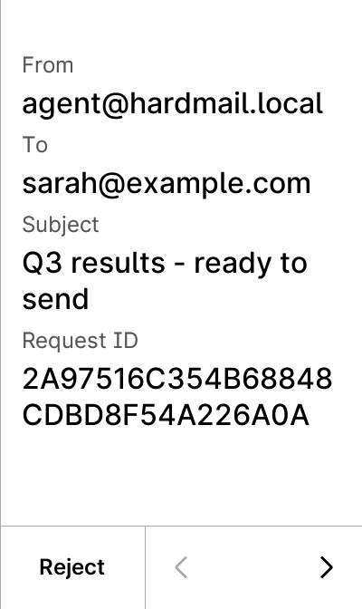
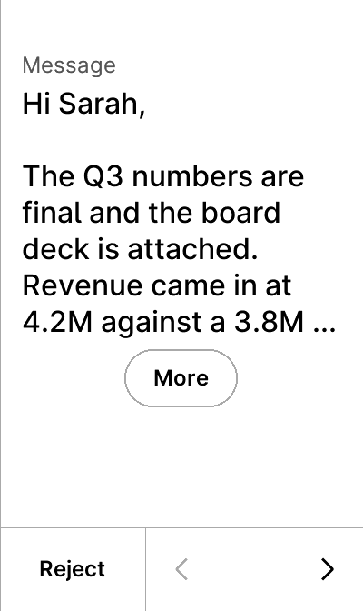
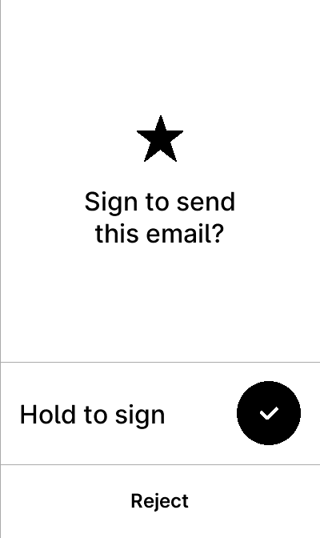

# HardMail — a clear-signing Ledger app for email

A Ledger device application that **clear-signs email**. It renders the actual
message — **From / To / Subject and the body in full** — on the device's own
trusted screen, and signs it with **ed25519**.

The point: a human approves an email having *read it on hardware*, not by
blindly confirming a hash. Change any byte afterwards and the signature stops
verifying. Nothing is hidden behind a digest: a message too long to display is
**refused**, never truncated — if it signs, the human saw all of it.

Built from [LedgerHQ/app-boilerplate](https://github.com/LedgerHQ/app-boilerplate)
(Apache-2.0, see [LICENSE.md](LICENSE.md)) with Ledger's own toolchain.

Companion host software (agent + verifying relay):
**[ledger-hardmail](https://github.com/itsgriznft/ledger-hardmail)**.

## What the user sees (Stax)

<p align="center">
  
  
  
</p>

Real screenshots from Speculos, not mockups. The middle one is the point: the
device is rendering the message itself, so what you approve is what gets sent.

An attachment cannot be *read* on a device screen — no hardware wallet renders a
PDF. What the device does is **bind** it: the human decides on the file's name
and size, and the signature covers its SHA-256, so the exact bytes are pinned
and cannot be swapped afterwards.

The **Request ID** is a single-use challenge issued by the verifier moments
earlier. Because it is part of the signed bytes, an approval is only valid for
that one request — a signature that is captured or withheld cannot be used
later.

## Protocol

`CLA = 0xE0`. Derivation path prefix `44'/1'`.

| INS | Name | Notes |
|---|---|---|
| `0x03` | GET_VERSION | |
| `0x04` | GET_APP_NAME | |
| `0x05` | GET_PUBLIC_KEY | ed25519; the compressed 32-byte key sits at `raw_public_key[1..33]` (a valid Stellar `G…` address when encoded) |
| `0x06` | SIGN | two chunks, see below |

**SIGN** — chunk 0 (`P1=0x00, P2=0x80`): BIP32 path. Chunks 1..N carry the email
payload, 255 bytes each, `P2=0x80` on every chunk but the last (`P2=0x00`):

```
challenge(16) | from_len:u8|from | to_len:u8|to | subj_len:u8|subj
              | body_len:u16be|body
              | att_count:u8  [ name_len:u8|name | size:u32be | sha256(32) ]
```

Every text field must be **printable ASCII** (`0x20..0x7e`), non-empty, and
within bounds (from ≤ 128, to ≤ 128, subject ≤ 200, body ≤ 2048; the body may
also contain `\n`). At most one attachment. Anything else is refused — which is
also what makes header injection impossible. No trailing bytes are allowed.

Response: `sig_len(1) || signature(64) || v(1)` — an ed25519 signature over
`sha256(payload)`, i.e. over exactly the bytes the device displayed.

## Build

```bash
docker run --rm -e BOLOS_SDK=/opt/stax-secure-sdk -v "$(pwd)":/app \
  ghcr.io/ledgerhq/ledger-app-builder/ledger-app-builder-lite:latest \
  bash -c 'cd /app && make -j'
# -> bin/app.elf
```

Other targets: `$FLEX_SDK`, `$APEX_P_SDK`.

**Touchscreen devices only** (Stax, Flex, Apex). Clear-signing an email means
rendering the whole message, and a 128x64 Nano screen cannot do that honestly —
so rather than fall back to a hash there, the app simply does not target Nano.

## Run in the emulator

```bash
docker run -d --name hardmail-app -v "$(pwd)/bin":/apps -p 5002:5000 -p 40002:40000 \
  ghcr.io/ledgerhq/speculos:latest --model stax --display headless \
  --api-port 5000 --apdu-port 40000 /apps/app.elf
```

Open <http://localhost:5002> to see the screen. Speculos uses a **public test
seed** — never send real value to keys derived from it.

## Security notes

- **Never blind-signs.** There is no blind-sign path: the app parses the fields
  and displays them, or it refuses. The body is shown as text, not a digest.
- **Fails closed.** Any malformed length, non-printable byte, oversized body, or
  trailing data aborts with an error rather than proceeding. In particular a body
  that would not fit on screen is rejected instead of being silently cut off.
- **The signature binds the display.** It covers `sha256(payload)`, and the
  payload *is* what was rendered — so a verifier that recomputes the payload
  from an email proves the human saw that exact email.
- **Approvals are not transferable in time.** The verifier's single-use challenge
  is inside the signed payload (and shown as the Request ID), so a signature is
  scoped to one request.
- The signing key never leaves the secure element; approval requires the
  physical hold-to-sign gesture.

## Status

Proof of concept: not audited, and not submitted to Ledger's app store.

It does follow the shape Ledger asks of an app, though — see
[ledger-app-ai-instructions](https://github.com/LedgerHQ/ledger-app-ai-instructions):

```
unit tests    14 parser cases (happy paths + every fail-closed path)   PASS
functional    24 Ragger tests x stax / flex / apex_p, golden snapshots PASS
```

```bash
# unit tests
docker run --rm -v "$(pwd)":/app <builder-image>   bash -c 'cd /app/unit-tests && cmake -Bbuild -H. && make -C build && cd build && ctest'

# functional tests on every device in ledger_app.toml
pip install "ragger[speculos]"
./tests/run_all_devices.sh              # verify against committed snapshots
./tests/run_all_devices.sh --golden     # regenerate them
```
